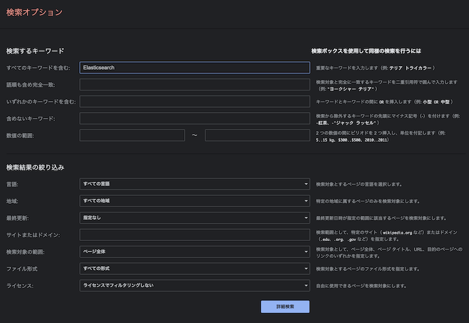

# Elasticsearch ハンズオン

---

## @kaiba

- 受託 → PIXTA → 不動産 → LINE → mov
- なんでもやらせていただいておりますが最近は LLM とバックエンド
- 技術書典で Elasticsearch の本を出して 250 冊 @ 500 くらい売れた
  - 125,000 円 - 印刷費 - 人件費(0 円)
  - 買ってもらえるとめっちゃ嬉しい。技術書典はいいぞ。

---

## アジェンダ

- 話してる間に環境構築
- Elasitcsearch って何？
- ハンズオン
- 検索の面白い/難しいところ

---

## 今日覚えて帰ること

**Elasticsearch** (NG: ElasticSearch, Elastic Search) には

- `json` で探したいものを入れ
- `json` でクエリを組み
- `json` で結果を受け取る

---

# 話してる間に環境構築

---

## ELK stack (Elasticsearch, Logstash, Kibana)

`deviantony/docker-elk` にセキュリティ関連を無効(本番ではだめだぞ)にし、日本語のプラグインをいれたもの。

```bash
# port 9200,5601 を使うので他のプロセスが動いている場合止めておいくてください
git clone git@github.com:kaibadash/docker-elk.git
cd docker-elk
git checkout ja_no_security
docker compose up setup
docker compose up
```

---

# Elasitcsearch って何？

---

## Elasitcsearch って何？

- Lucene(検索エンジンライブラリ)を基盤にした全文検索エンジン
- 分散
- JSON を入れるドキュメントデータベース
- REST API
- Elastic 社が運営している OSS
- Elastic License 2.0 (商業利用を制限) + Server Side Public License(クラウドで使うならコードを公開する) + GNU Affero General Public License(Web アプリ版 GPL)

---

## コラム: AWS OpenSearch ?

いわゆる「OSS ただ乗り」問題があった。

- Elastic「AWS で手をいれた Elasticsearch を Elasticsearch という名前で使うな。金払ってやれ。」
- AWS「OpenDistro として公開しているし、パッチも送って貢献しているのに。Fork して OpenSearch って名前にしますわ」
- Elastic「クライアントライブラリから OpenSearch に繋げなくするわ」
- ユーザ「クライアントライブラリをアップデートしたら OpenSearch に繋がらなくなったぞ!」
- AWS「クライアントライブラリも Fork するわ」
- ユーザ「今後どうなるんだ…」

---

## Elasitcsearch は何ができる？

- 検索というと Google。雑に言うとあれが作れる。
- 柔軟なテキスト検索
  - 日本語を意識した検索(後述)
  - 正規化(ﾄﾞﾗｸｴ Ⅲ とか)
- ページング
- ハイライト
- ソート順の調整
- 様々な検索条件(除外、範囲、etc…)
- 集計

---

## なんで RDB じゃだめなの？

一番あるユースケース:

```sql
SELECT
	*
FROM
	items
WHERE
	description LIKE '%search%';
```

**オイオイオイ 死ぬわアイツ**
一般的に RDB は部分一致はフルスキャン(最近は full text index もあるが)。

---

## Web アプリケーションに検索はつきもの

- RDB にどんな index をつければいいんだ？
- 見るからに遅くなりそう…



---

# ハンズオン

- 本の検索サービス
- id, title, author, title_yomi, author_yomi をいれて検索する例

---

## ハンズオンでやること

- Elasticsearch の管理ツールである Kibana を使ってみる
- ドキュメントをいれて検索してみる
- 自社サービスのデータを見てみる(あれば)

---

## Kibana を見てみよう

http://localhost:5601

- user: elastic
- password: changeme

---

## ドキュメントをいれて検索してみよう

- コピペ用ファイル参照

---

# 検索の面白い/難しいところ

---

## 何をどのように検索したいのか？

Google が一般的になりすぎて **「Google みたいにして！」** って言われがちだが、ユースケースをちゃんと考える必要がある。

- PC? あいうえおのタッチパッド?
- ヒットすることと同じくらいヒットしないことも大切
- 大切な情報が上に来てほしい
- Google Search はすごい。文化の極みだよ。

---

## 人は時と場合によって言うことが違う

- ヒットしない!
- ヒットするようにしたよ => ゴミがヒットする!
- ゴミがヒットしないようにしたよ => ヒットしない!

このへんの曖昧な仕様が「Google みたいに検索」という要件で落ちてくる。

**そうだ テスト書こう**
Docker で Elasticsearch を立ててそれにリクエストするテスト。

---

## 東京都府中市 問題

- 部分一致で住所探したい
- 「京都府」で探すと…
- `analysis-kuromoji` プラグインの `kuromoji_tokenizer` を使おう
  - 東京、都、府中、市 のように分割され「京都府」ではヒットしなくできる

---

## とある科学の超電磁砲 問題

- 図書館のタッチパッドなのでよみがなで探せるようにしたい
- よみがなで探してもヒットしない!
- 「ちょうでんじほう」でヒットした! これだから素人は…(深い溜息)
- アプリケーション側でよみがなの管理が必要になる。ユースケースとして事前に確認すべし。
- 禁書目録、頭文字 D なども。

---

## 検索だけじゃない色々できる

- ベクトル検索で Amazon みたいな関連商品リコメンド
- グルーピングして集計
- json には RDB のような関連はないが親子関係を表現
- word や PDF や画像の検索もしたい

---

## おわり

明日からキミも検索エンジニア！

`match` を覚えたぐらいでいい気になるなよ ♠
Elasticsearch は奥が深い(ﾎﾞﾎﾞﾎﾞ…)
続きは[検索だけじゃない Elasticsearch 入門+](https://kaiba.booth.pm/items/1031664)でぜひ!
